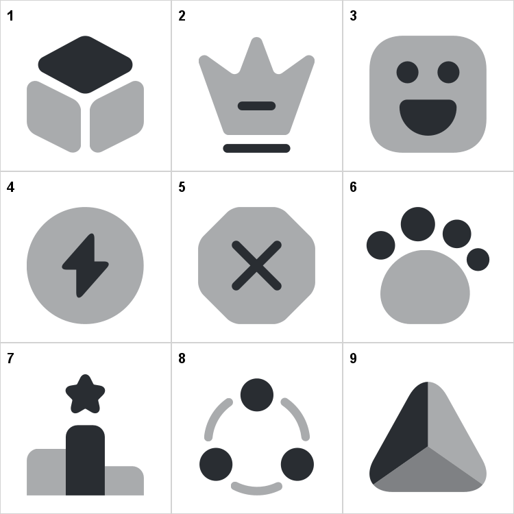

# SVG-Grid-Image-Generator
Easily display all SVG files in a single image


## Description
That takes a lot to place all the SVG files in one picture.<br>
Measuring how much space they have to take, sorting out how to form a grid from it.<br>
Oh, and if it has to be numerated, file-named, hundreds of SVG's can be a tragedy for your solid patience.

You can use my utility to combine all SVG files in a one PNG image.

For example,
```java
SvgGridImageGenerator.generateSvgGridImage();
```
will show you this in terminal
```
Searching for .svg files...
249 files found. They will be shown in a 16x16 grid.
Processing final image (249/249)...
Done! Check for the output file svg_grid_output.png
249 files processed successfully. 0 files skipped.
```
and create you a file named `svg_grid_output.png` in your project directory.



## How to use
1. Clone the project to your IDE (e.g. for IntellJ IDEA: "File" - "New" - "Project from Version Control..." - "URL" - paste `https://github.com/hoteymaks/svg-grid-image-generator.git` in URL field)
2. Create any folder inside `src/java/` and paste SVG files there, or just paste without creating a folder
3. Open `SvgGridImageGenerator.java` and adjust utility settings by changing values of static fields, like `MODE`, `CELL_WIDTH`, `CELL_HEIGHT`, etc.
4. Run my code
5. Wait until the process finishes
6. Check the results in the project directory. `svg_grid_output.png` lays in the root directory of your project `./`

## Importing the generator
Utility supports basic static methods for external use. This means that you can access next methods from your project classes:
```java
// Default path (project directory), numerating cells by default (1, 2, 3...)
generateSvgGridImage()
// Default path, picking custom labeling mode: NONE, FILE_NAME or NUMERATE
generateSvgGridImage(LabelMode)
// Custom path, numerating cells by default (1, 2, 3...)
generateSvgGridImage(Path)
// Custom path, custom labeling mode: NONE, FILE_NAME or NUMERATE
generateSvgGridImage(Path, LabelMode)
```

## How it works
- Utility goes through every file in the directory it is in. So make sure you're not running it from your system's root directories.
- It handles only SVG files, other files are ignored and don't cause exception crashes.
- Files that couldn't be processed during generating are listed in the terminal output and skipped. The total count of skipped files will be displayed in the end as well.

SVG files are imported in alphabetical order.<br>
Feel free to pull request order support static methods!

## All design modifications and their defaults
<table>
  <tr>
    <th>Parameter</th>
    <th>Description</th>
    <th>Default Value</th>
  </tr>
  <tr>
    <td><code>MODE</code></td>
    <td>Labeling mode:
      <ul>
        <li>
          <code>LabelMode.NONE</code> (no labels)
        </li>
        <li>
          <code>LabelMode.NUMERATE</code> (1, 2, 3...)
        </li>
        <li>
          <code>LabelMode.FILE_NAME</code> (displays file names in cells)
        </li>
      </td>
    <td><code>LabelMode.NUMERATE</code></td>
  </tr>
  <tr>
    <td><code>CELL_WIDTH</code></td>
    <td>Width of each cell in the grid (in pixels)</td>
    <td>250</td>
  </tr>
  <tr>
    <td><code>CELL_HEIGHT</code></td>
    <td>Height of each cell in the grid (in pixels)</td>
    <td>250</td>
  </tr>
  <tr>
    <td><code>PADDING</code></td>
    <td>Padding around each cell (in pixels)</td>
    <td>10</td>
  </tr>
  <tr>
    <td><code>NUMBER_PADDING</code></td>
    <td>Padding between number/text and SVG shape (in pixels)</td>
    <td>5</td>
  </tr>
  <tr>
    <td><code>FONT_SIZE</code></td>
    <td>Font size for the label text (in points)</td>
    <td>20</td>
  </tr>
  <tr>
    <td><code>FONT_NAME</code></td>
    <td>Name of the font used for labeling</td>
    <td><code>Arial</code></td>
  </tr>
  <tr>
    <td><code>NUMBER_COLOR</code></td>
    <td>Color of the text/number labels</td>
    <td><code>Color.BLACK</code></td>
  </tr>
  <tr>
    <td><code>BORDER_COLOR</code></td>
    <td>Color of the border around each cell</td>
    <td><code>new Color(211, 211, 211)</code><br><i>(it's light-gray)</i></td>
  </tr>
  <tr>
    <td><code>ANTI_ALIASING</code></td>
    <td>Improves font rendering quality. Should generally remain enabled unless custom fonts render poorly</td>
    <td><code>true</code></td>
  </tr>
</table>
